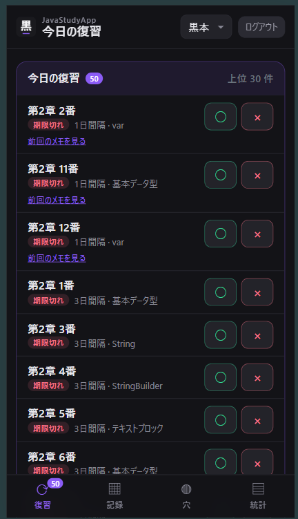
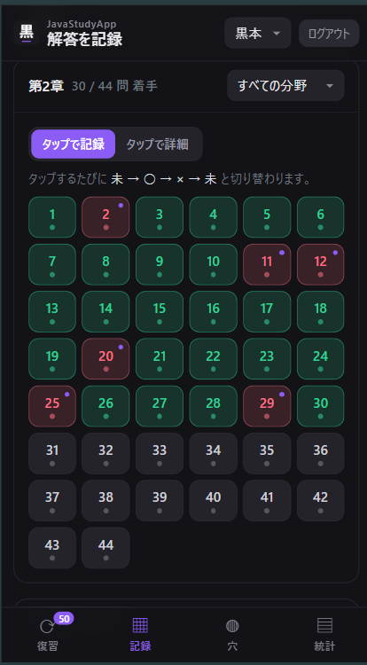
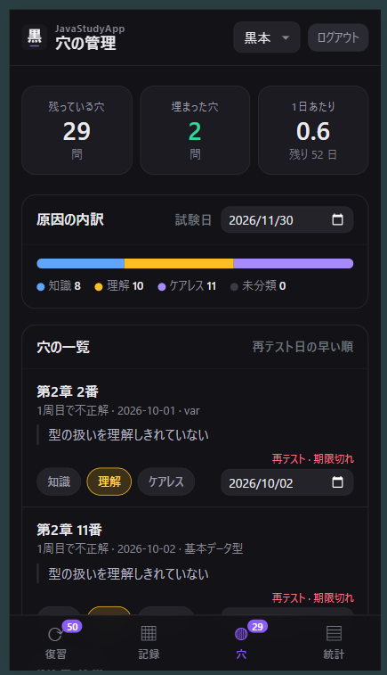
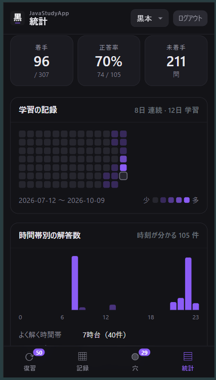

# JavaStudyApp

Java Silver の問題集（黒本・紫本）の解答を記録し、**間違えた問題＝「穴」を見える化して、復習のタイミングまで管理する**学習記録アプリです。

<!-- スクリーンショット：docs/screenshots/ に画像を置いて差し替えてください -->
| 復習 | 記録 | 穴 | 集計 |
|---|---|---|---|
|  |  |  |  |

---

## 作ったきっかけ（課題）

資格勉強で問題集を何周かしているうちに、次のことに困っていました。

- どの問題を間違えたのか、紙やメモでは追いきれない
- 「なぜ間違えたのか」を残していないので、同じミスをくり返す
- 次にいつ解き直せばいいのかが分からず、復習が後回しになる

## どう解決したか

| 課題 | このアプリでの解決 |
|---|---|
| 間違えた問題を追えない | 章・問題番号ごとに正誤を記録し、未着手／正解／不正解を一覧で表示 |
| 同じミスをくり返す | 間違えた理由をメモし、原因を「知識・理解・ケアレスミス」に分類 |
| 復習が後回しになる | 間違えた問題に次の再テスト日を自動で設定し、「今日の復習」に表示 |
| 苦手が分からない | 章ごと・分野ごとの正答率、学習した日と時間帯を集計 |

使い続けるうちに、学習のペースが安定してきたことも、作ってよかった点です。

---

## 主な機能

- **復習**：再テスト日が来た問題を一覧表示し、その場で正誤を記録
- **記録**：章ごとの問題をタイルで表示し、まとめて正誤を入力
- **穴**：間違えた問題を原因別に管理。解き直して正解すると「埋まった穴」になる
- **集計**：章・分野ごとの正答率、日別の解答数、解く時間帯の傾向
- **教材の切り替え**：黒本・紫本など、教材ごとに別のデータベースで管理
- **スマホ対応**：PWA としてホーム画面に追加でき、アプリのように使える
- **ログイン**：パスワードを設定すると、ログイン画面で保護される（未設定なら認証なし）

## 技術構成

| 区分 | 使用技術 |
|---|---|
| バックエンド | Java 21（標準ライブラリの `HttpServer`）、JDBC |
| データベース | H2 Database（ファイル保存） |
| フロントエンド | HTML / CSS / JavaScript、Bootstrap 5、PWA（Service Worker） |
| インフラ | Docker / Docker Compose、nginx（リバースプロキシ） |
| 運用 | Oracle Cloud（ARM インスタンス）＋ Tailscale |

```
ブラウザ ─→ nginx ─→ Java アプリ（HttpServer） ─→ H2 Database
            │
            └ 静的ファイル（CSS・アイコンなど）は nginx が直接返す
```

### 設計で意識したこと

- **層を分ける**：画面（`web/`）、API（`web/WebServer`）、データアクセス（`dao/`）、データの型（`entity/`）に分けて、SQL を DAO に集めた
- **フレームワークに頼らない**：Java の基礎を固める目的で、Spring などは使わず標準ライブラリで HTTP サーバーを組んだ
- **安全側に倒す**：
  - パスワードは PBKDF2 でハッシュ化して保存（平文で持たない）
  - ログイン API は nginx でアクセス回数を制限（総当たり対策）
  - コンテナは root ではなく一般ユーザーで実行
  - 外部には直接ポートを開けず、Tailscale 経由でのみ公開

## ディレクトリ構成

```
src/com/pereperia/
├── Main.java          起動（CLI / Web の切り替え）
├── dao/               データベースの読み書き
├── entity/            データの型（record）
├── report/            学習進捗の Markdown 出力
└── web/               HTTP サーバー、API、認証
web/                   画面（HTML / CSS / JS）
sql/
├── schema.sql         テーブル定義
└── demo.sql           動作確認用の見本データ
nginx/                 リバースプロキシの設定
```

---

## 動かし方

### Docker で動かす

```bash
cp .env.example .env
docker compose up -d --build
```

`http://localhost:8080` を開きます。

### Java で直接動かす

```bash
mkdir -p bin
javac -encoding UTF-8 -d bin -cp lib/h2-2.2.224.jar $(find src -name "*.java")
java -cp "bin:lib/h2-2.2.224.jar" com.pereperia.Main web
```

### 見本データで試す

次のスクリプトで、ビルド・見本データの投入・起動までまとめて行えます。

```bash
scripts/demo.sh
```

`http://localhost:8080` を開き、ユーザー名 `demo` / パスワード `demo` でログインします。

※ 見本データ（`sql/demo.sql`）は動作確認用で、実際の学習記録ではありません。日付は投入した日を基準に作られます。

---

## 開発の進め方と AI の活用について

このアプリは、生成 AI（Claude）を活用して作りました。

- **Java 部分**（DAO、エンティティ、CLI など）：AI が示したコードをコピーせず、自分の手で打ち込みながら、1 行ずつ動きを確かめて理解することを重視しました
- **Web 画面・Docker・nginx・クラウドへの移設**：AI が作成したものを、動かしながら構成や役割を確認して組み込みました

Java Silver の学習と並行して、学んだ文法（record、例外処理など）がアプリのどこで使われているかを確認する教材としても使っています。
