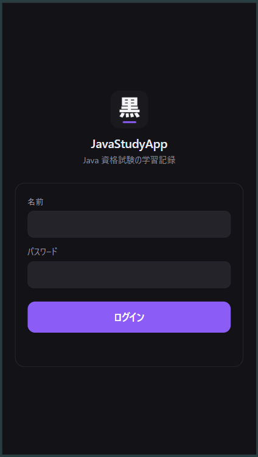
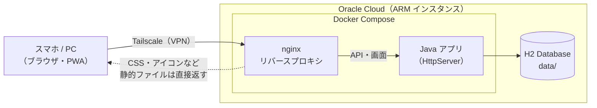

# JavaStudyApp

Java Silver の問題集（黒本・紫本）の解答を記録し、**間違えた問題＝「穴」を見える化して、復習のタイミングまで管理する**学習記録アプリです。

| 復習 | 記録 | 穴 | 統計 |
|---|---|---|---|
|  |  |  |  |

※ 画面は見本データ（`sql/demo.sql`）を表示したものです。

---

## 作ったきっかけ（課題）

資格勉強で問題集を何周かしているうちに、次のことに困っていました。

- どの問題を間違えたのか、紙やメモでは追いきれない
- 「なぜ間違えたのか」を残していないので、同じミスをくり返す
- 次にいつ解き直せばいいのかが分からず、復習が後回しになる

## どう解決したか

| 課題 | このアプリでの解決 |
|---|---|
| 間違えた問題を追えない | 章・問題番号ごとに正誤を記録し、未着手／正解／不正解を一覧で表示 |
| 同じミスをくり返す | 間違えた理由をメモし、原因を「知識・理解・ケアレスミス」に分類 |
| 復習が後回しになる | 間違えた問題に次の再テスト日を自動で設定し、「今日の復習」に表示 |
| 苦手が分からない | 章ごと・分野ごとの正答率、学習した日と時間帯を集計 |

使い続けるうちに、学習のペースが安定してきたことも、作ってよかった点です。

---

## 主な機能

- **復習**：再テスト日が来た問題を一覧表示し、その場で正誤を記録
- **記録**：章ごとの問題をタイルで表示し、まとめて正誤を入力
- **穴**：間違えた問題を原因別に管理。解き直して正解すると「埋まった穴」になる
- **統計**：章・分野ごとの正答率、日別の解答数、解く時間帯の傾向
- **教材の切り替え**：黒本・紫本など、教材ごとに別のデータベースで管理
- **スマホ対応**：PWA としてホーム画面に追加でき、アプリのように使える
- **ログイン**：パスワードを設定すると、ログイン画面で保護される（未設定なら認証なし）



## 技術構成

| 区分 | 使用技術 |
|---|---|
| バックエンド | Java 21（標準ライブラリの `HttpServer`）、JDBC |
| データベース | H2 Database（ファイル保存） |
| フロントエンド | HTML / CSS / JavaScript、Bootstrap 5、PWA（Service Worker） |
| インフラ | Docker / Docker Compose、nginx（リバースプロキシ） |
| 運用 | Oracle Cloud（ARM インスタンス）＋ Tailscale |

### 構成図



## 作り方の変遷

最初から完成形を目指さず、使いながら「困ったこと」を 1 つずつ解決する形で育ててきました。

| 時期 | 段階 | 変えたこと | きっかけ |
|---|---|---|---|
| 2026年8月上旬 | ① CLI 版 | ターミナルで番号を選んで記録するアプリとして作成。DAO と entity の層を分けた | まずは Java の基礎（JDBC・クラス設計）を、動くもので身につけたかった |
| 2026年8月中旬 | ② Web 版 | 標準ライブラリの `HttpServer` で API を作り、画面を HTML / JS に。PWA 化してスマホのホーム画面から開けるようにした | 問題集を解くのは机以外の場所も多く、ターミナルを開くのが手間だった |
| 2026年8月下旬 | ③ 復習機能 | 「穴」の原因分類、再テスト日の自動設定、時間帯別の集計を追加 | 記録するだけでは、同じ問題をくり返し間違えていた |
| 2026年9月 | ④ クラウド移設 | Docker 化し、nginx を前に置いて Oracle Cloud で常時稼働。Tailscale で自分の端末からだけ届くようにした | 自宅 PC の電源を切ると使えず、外出先から記録できなかった |

## 設計判断の理由

| 判断 | 選んだもの | 理由 | 見送ったもの |
|---|---|---|---|
| Web サーバー | Java 標準の `HttpServer` | フレームワークに隠れる部分（リクエスト処理・ルーティング）を自分で書いて理解したかった | Spring Boot（学習の目的に対して大きすぎる） |
| データベース | H2（ファイル保存） | 1 人で使うアプリなので別サーバーが不要。ファイルのコピーだけでバックアップ・移設できる | MySQL / PostgreSQL（運用の手間が増える） |
| 公開方法 | Tailscale 経由のみ | インターネットにポートを開けずに済み、攻撃を受ける入口を作らない | ポートを公開してログインだけで守る |
| 前段の nginx | 置く | 静的ファイルの配信と、ログイン API の回数制限をアプリから切り離せる | アプリだけで全部返す |
| 教材ごとの DB | 分ける | 黒本・紫本で問題数も章構成も違うため、混ぜずに切り替えられる形にした | 1 つの DB に教材の列を足す |

### そのほか意識したこと

- **層を分ける**：画面（`web/`）、API（`web/WebServer`）、データアクセス（`dao/`）、データの型（`entity/`）に分け、SQL は DAO に集めた
- **安全側に倒す**：パスワードは PBKDF2 でハッシュ化して保存（平文で持たない）／コンテナは root ではなく一般ユーザーで実行

## ディレクトリ構成

```
src/com/pereperia/
├── Main.java          起動（CLI / Web の切り替え）
├── dao/               データベースの読み書き
├── entity/            データの型（record）
├── report/            学習進捗の Markdown 出力
└── web/               HTTP サーバー、API、認証
web/                   画面（HTML / CSS / JS）
sql/
├── schema.sql         テーブル定義
└── demo.sql           動作確認用の見本データ
nginx/                 リバースプロキシの設定
```

---

## 動かし方

### Docker で動かす

```bash
cp .env.example .env
docker compose up -d --build
```

`http://localhost:8080` を開きます。

### Java で直接動かす

```bash
mkdir -p bin
javac -encoding UTF-8 -d bin -cp lib/h2-2.2.224.jar $(find src -name "*.java")
java -cp "bin:lib/h2-2.2.224.jar" com.pereperia.Main web
```

### 見本データで試す

次のスクリプトで、ビルド・見本データの投入・起動までまとめて行えます。

```bash
scripts/demo.sh
```

`http://localhost:8080` を開き、ユーザー名 `demo` / パスワード `demo` でログインします。

※ 見本データ（`sql/demo.sql`）は動作確認用で、実際の学習記録ではありません。日付は投入した日を基準に作られます。

---

## 開発の進め方と AI の活用について

このアプリは、生成 AI（Claude）を活用して作りました。

- **Java 部分**（DAO、エンティティ、CLI など）：AI が示したコードをコピーせず、自分の手で打ち込みながら、1 行ずつ動きを確かめて理解することを重視しました
- **Web 画面・Docker・nginx・クラウドへの移設**：AI が作成したものを、動かしながら構成や役割を確認して組み込みました

Java Silver の学習と並行して、学んだ文法（record、例外処理など）がアプリのどこで使われているかを確認する教材としても使っています。
